# projetoQuiz-CSharp
um quiz feito com winforms lá no visual studio. 10 perguntas fáceis só para treinar o código. Atividade de DS na Etec de Guarulhos.
 

  <h3>Página Inicial do quiz</h3>
  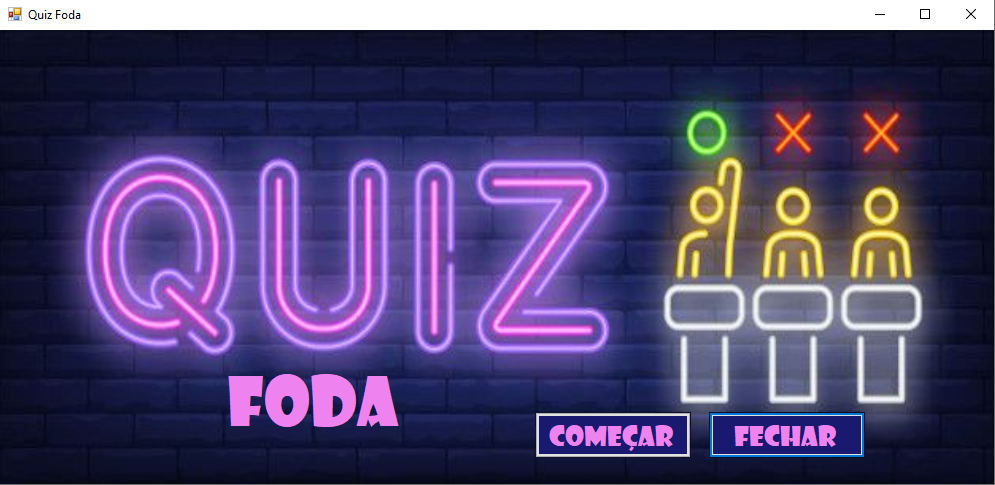

 

  <h3>Na primeira pergunta toca de fundo a música do Daft Punk</h3>
  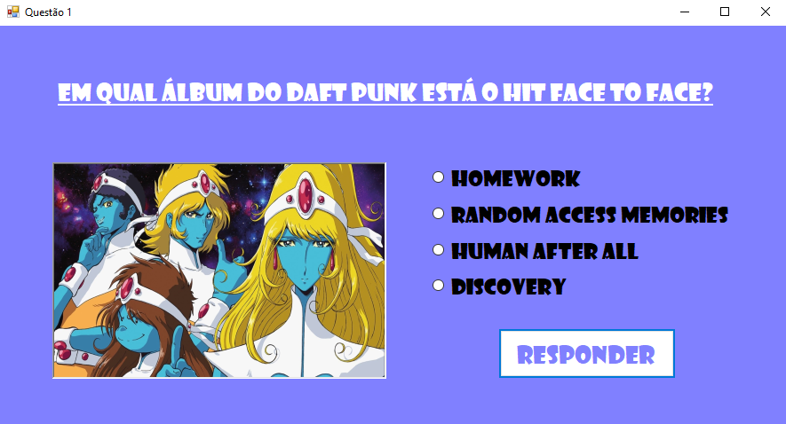

 

  <h3>Nessa segunda pergunta, a música da Billie Eilish toca de fundo</h3>
  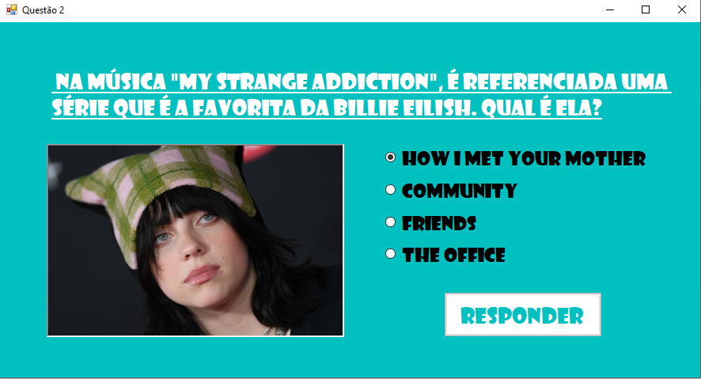

 

  <h3>Daqui pra frente um monte de pergunta só pra encher linguiça</h3>
  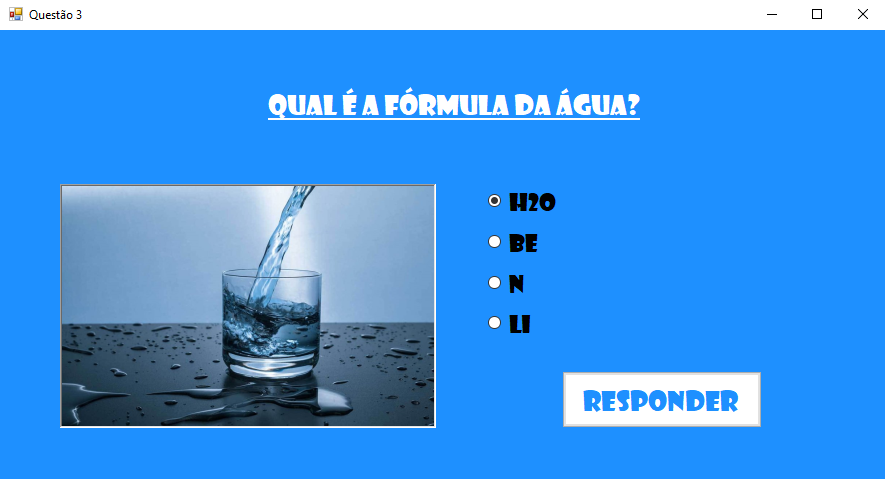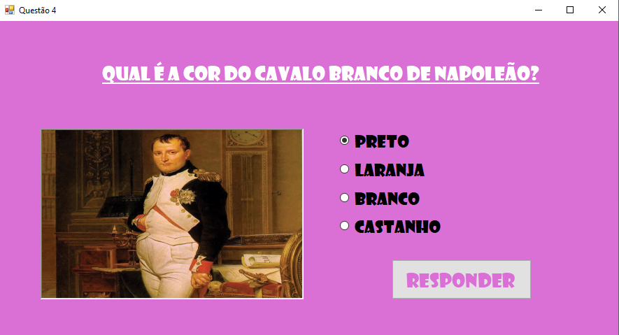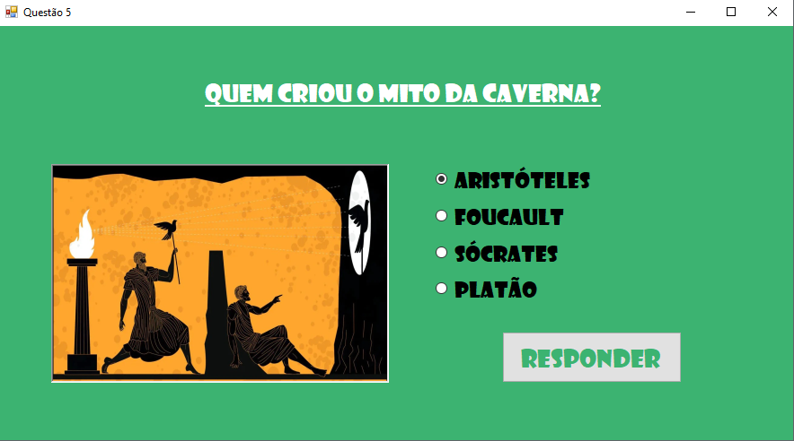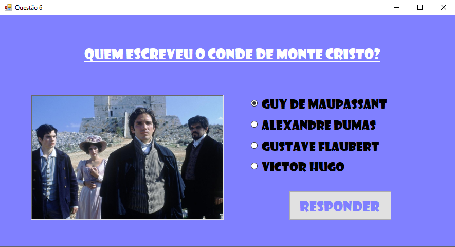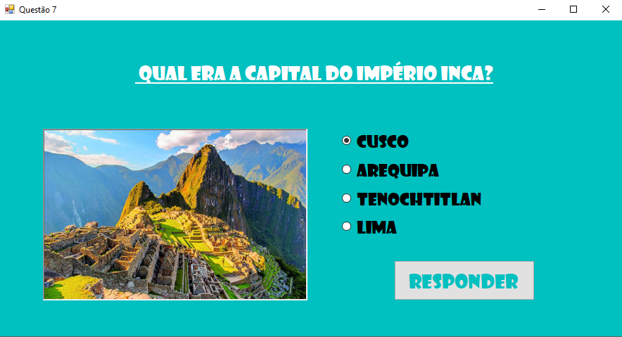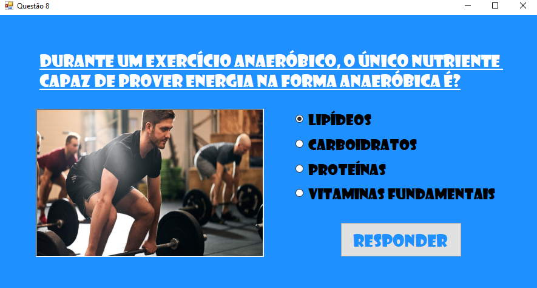

 

  <h3>Acabei colocando umas perguntas em inglês e francês</h3>
  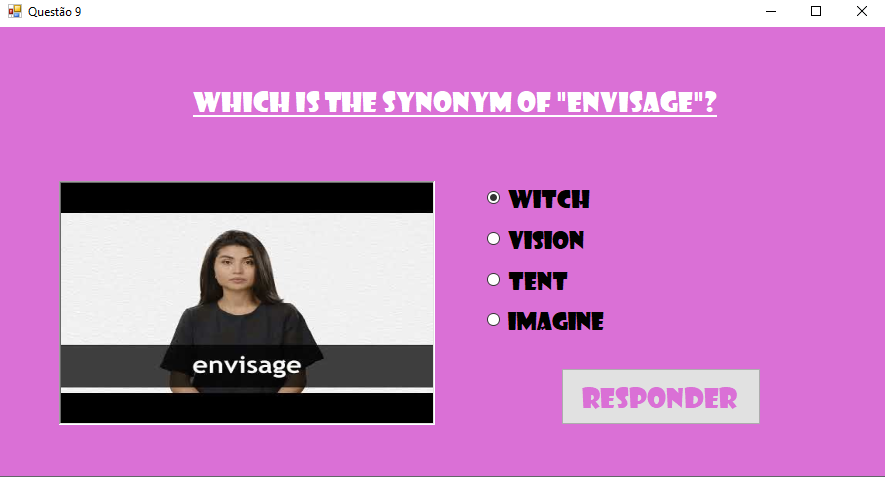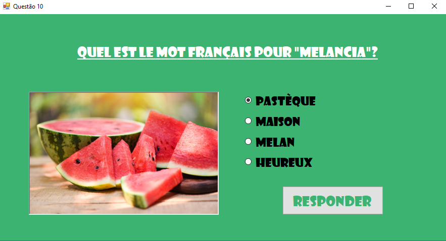

 

  <h3>Mensagem se acertar todas</h3>
  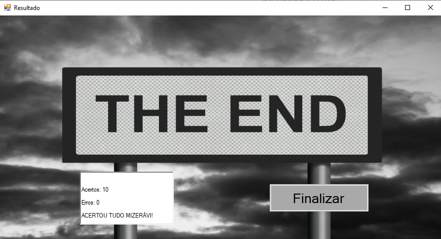

 

  <h3>Mensagem se errar uma</h3>
  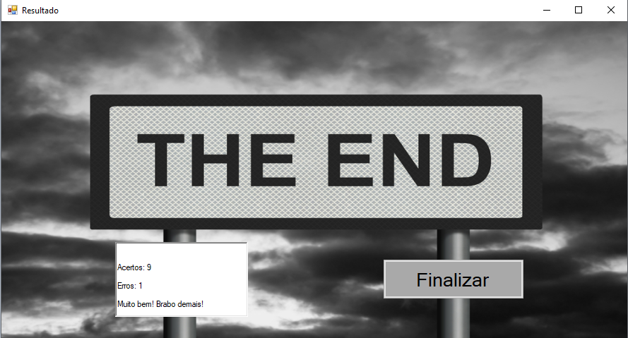

 

  <h3>Mensagem se errar um monte</h3>
  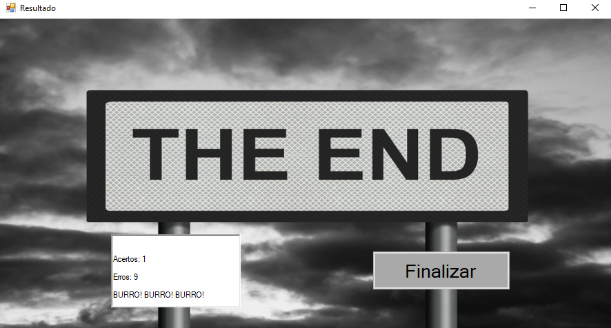

 
